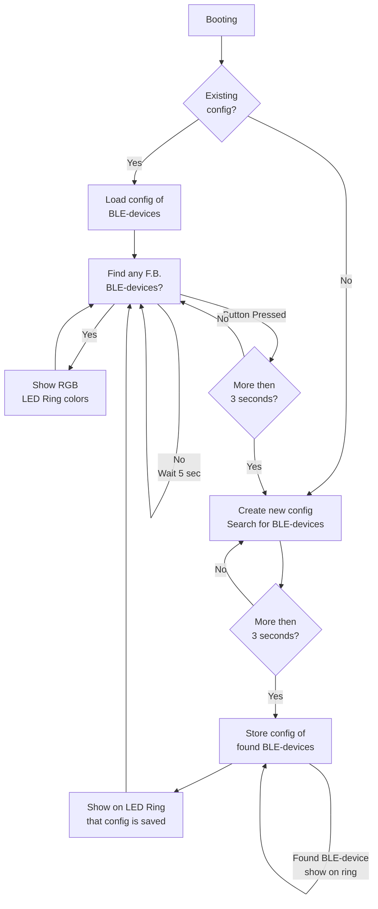

# Friend Beacon
A light beacon for friends

<h3>Parts:</h3>
- ESP32 C3 mini
- 3.7V 500mAh LiPo battery
- 3.7V LiPo battery charger
- Induction button
- RGB LED Ring
- 3D parts
  - Case
  - Diffuser
- <i>Optional, a vibration motor</i>

